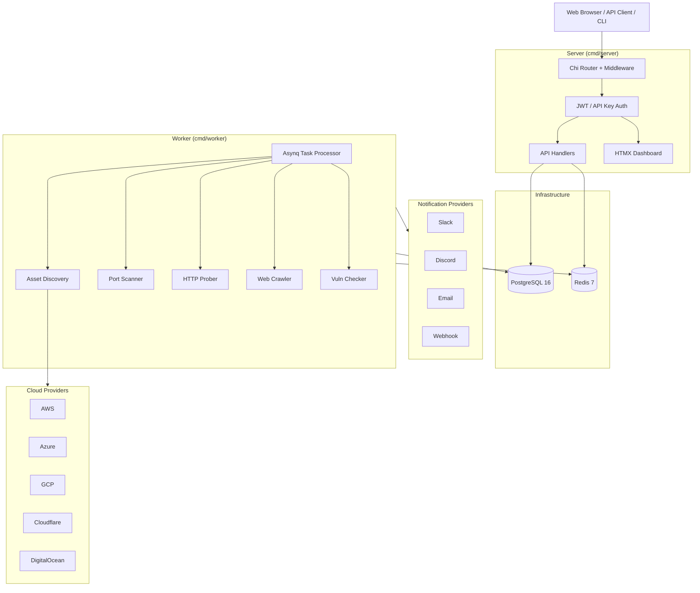

<p align="center">
  <h1 align="center">Go-Hunter</h1>
  <p align="center">
    <strong>Enterprise-grade cloud attack surface management platform built with Go</strong>
  </p>
  <p align="center">
    Discover, monitor, and secure your cloud infrastructure across AWS, Azure, GCP, Cloudflare, and DigitalOcean
  </p>
</p>

<p align="center">
  <a href="#"></a>
  <a href="LICENSE"></a>
  <a href="#"></a>
  <a href="#"></a>
</p>

<!--
<p align="center">
  
</p>
-->
<!-- TODO: Add demo screenshot or GIF -->


---

## The Problem

### Cloud Sprawl is a Security Nightmare

Modern organizations face unprecedented challenges in managing their cloud attack surface:

- **83%** of cloud security failures are due to misconfigurations (Gartner)
- **Average enterprise** uses 1,295 cloud services, but IT is only aware of 30% (Netskope)
- **70%** of all security incidents originate from unknown or unmanaged assets (Ponemon Institute)
- **Shadow IT** creates blind spots that traditional security tools miss entirely

### Why Traditional Solutions Fall Short

| Challenge | Traditional Approach | The Reality |
|-----------|---------------------|-------------|
| **Asset Discovery** | Manual inventory spreadsheets | Assets change hourly; spreadsheets are outdated immediately |
| **Multi-Cloud** | Separate tools per provider | Fragmented visibility, inconsistent security posture |
| **Continuous Monitoring** | Periodic manual scans | Attackers don't wait for your quarterly assessment |
| **Cost** | Enterprise licenses starting at $100K+ | Prohibitive for startups and mid-market companies |

---

## The Solution

**Go-Hunter** provides continuous attack surface discovery and vulnerability detection across your entire cloud infrastructure:

| Value Proposition | How We Deliver |
|-------------------|----------------|
| **Complete Visibility** | Automatically discover assets from 5 major cloud providers in minutes |
| **Real-Time Detection** | Continuous scanning with instant alerts for new vulnerabilities |
| **Multi-Tenant by Design** | Full data isolation for MSPs and enterprise teams |
| **Developer-First** | RESTful API, webhook integrations, and CLI tools |
| **Self-Hosted Control** | Your data stays on your infrastructure |

---

## Features

### Cloud Provider Integrations

| Provider | Asset Types | Status |
|----------|-------------|--------|
| **AWS** | EC2, S3, Route53, ELB, RDS, Lambda | Production |
| **Azure** | VMs, Storage, DNS, Load Balancers | Production |
| **GCP** | Compute, Storage, Cloud DNS | Production |
| **Cloudflare** | DNS Zones, Workers | Production |
| **DigitalOcean** | Droplets, Spaces, Domains | Production |

### Security Scanning Capabilities

- **Asset Discovery** - Automatically enumerate assets from connected cloud accounts
- **Port Scanning** - High-performance TCP scanning with banner grabbing and service detection
- **HTTP Probing** - Web service detection with technology fingerprinting
- **Web Crawling** - Discover endpoints, forms, and hidden assets
- **Vulnerability Checking** - S3 bucket exposure, misconfigurations, and more
- **Scheduled Scans** - Cron-based scheduling for continuous monitoring

### Platform Features

- **Multi-Tenant Architecture** - Full organization isolation with RBAC
- **JWT + API Key Authentication** - Stateless auth for web and CI/CD automation
- **Real-Time Dashboard** - HTMX-powered live updates
- **RESTful API** - Complete programmatic access with Prometheus metrics
- **Encrypted Credentials** - age encryption for cloud provider secrets
- **Audit Logging** - Track all security-relevant operations
- **Notification Engine** - Slack, Discord, Email, and generic webhook integrations
- **Asset Tagging** - Key:value tags with tag-based filtering
- **Brute-Force Protection** - Login rate limiting with exponential backoff

---

## Quick Start

### One-Line Docker Setup

```bash
docker-compose up -d
```

Visit `http://localhost:8080` and login with demo credentials:
- **Email:** `demo@example.com`
- **Password:** `demo1234`

### Local Development Setup

**Prerequisites:**
- Go 1.22+
- Docker and Docker Compose

**Step 1: Clone and configure**
```bash
git clone https://github.com/hugh/go-hunter.git
cd go-hunter
cp .env.example .env
```

**Step 2: Start infrastructure**
```bash
docker-compose up -d postgres redis
```

**Step 3: Run database migrations and seed data**
```bash
go run scripts/seed.go
```

**Step 4: Start the server** (terminal 1)
```bash
go run ./cmd/server
```

**Step 5: Start the worker** (terminal 2)
```bash
go run ./cmd/worker
```

**Step 6: Access the dashboard**
```
http://localhost:8080
```

### Development Commands

```bash
# Run tests
go test ./...

# Run with hot reload (requires air)
air

# Format code
go fmt ./...

# Lint
golangci-lint run
```

---


```

### Scans

**Start a Port Scan**
```bash
curl -X POST http://localhost:8080/api/v1/scans \
  -H "Authorization: Bearer $TOKEN" \
  -H "Content-Type: application/json" \
  -d '{
    "type": "port_scan",
    "target_asset_ids": ["550e8400-e29b-41d4-a716-446655440002"]
  }'
```

**Get Scan Status**
```bash
curl http://localhost:8080/api/v1/scans/550e8400-e29b-41d4-a716-446655440003 \
  -H "Authorization: Bearer $TOKEN"
```

**Response:**
```json
{
  "id": "550e8400-e29b-41d4-a716-446655440003",
  "type": "port_scan",
  "status": "completed",
  "started_at": 1706400000,
  "completed_at": 1706400120,
  "assets_scanned": 5,
  "findings_count": 12,
  "ports_open": 8
}
```

**Scan Types:**
- `discovery` - Cloud asset discovery (requires credential_ids)
- `port_scan` - TCP port scanning
- `http_probe` - HTTP service detection
- `crawl` - Web crawling
- `vuln_check` - Vulnerability assessment
- `full` - Complete scan pipeline

### Error Format

All errors follow a consistent format with machine-readable error codes:

```json
{
  "code": "validation_error",
  "error": "Validation failed",
  "details": {
    "email": "Invalid email format",
    "password": "Password must be at least 8 characters"
  }
}
```

Error codes: `bad_request`, `unauthorized`, `forbidden`, `not_found`, `conflict`, `validation_error`, `internal_error`, `service_unavailable`

---

## Performance

### API Response Times

| Endpoint | p50 | p95 | p99 |
|----------|-----|-----|-----|
| `GET /api/v1/assets` | 12ms | 45ms | 120ms |
| `POST /api/v1/scans` | 8ms | 25ms | 80ms |
| `GET /api/v1/findings` | 15ms | 55ms | 150ms |

### Scanning Throughput

| Scan Type | Rate | Notes |
|-----------|------|-------|
| Port Scan | 10,000 ports/sec | Per worker, configurable concurrency |
| HTTP Probe | 500 requests/sec | With response parsing |
| Asset Discovery | 1,000 assets/min | AWS, varies by provider |

### Resource Usage

| Component | CPU (idle) | CPU (scanning) | Memory |
|-----------|------------|----------------|--------|
| Server | 0.1% | 2-5% | 50MB |
| Worker | 0.5% | 30-60% | 100MB |
| PostgreSQL | 1% | 5-10% | 256MB |
| Redis | 0.1% | 1-2% | 50MB |

---


```

### Architecture



### Tech Stack

| Layer | Technology |
|-------|------------|
| **Language** | Go 1.22+ |
| **Router** | Chi |
| **Database** | PostgreSQL 16 + GORM |
| **Queue** | Redis 7 + Asynq |
| **Frontend** | HTMX + Tailwind CSS + Alpine.js |
| **Auth** | JWT + bcrypt |
| **Encryption** | age (for credentials) |

### Project Structure

```
go-hunter/
├── cmd/
│   ├── server/          # HTTP API + web dashboard
│   └── worker/          # Background job processor
├── internal/
│   ├── api/             # HTTP handlers, middleware, DTOs
│   ├── assets/          # Cloud provider integrations
│   ├── auth/            # JWT, password hashing
│   ├── database/        # GORM models, migrations
│   ├── scanner/         # Scanning engines (port, http, crawler)
│   ├── tasks/           # Asynq task definitions
│   └── web/             # Embedded templates
├── pkg/
│   ├── circuitbreaker/  # Circuit breaker for API resilience
│   ├── config/          # Viper configuration
│   ├── crypto/          # age encryption wrapper
│   ├── errors/          # Typed domain errors
│   ├── metrics/         # Prometheus metrics
│   ├── queue/           # Asynq client wrapper
│   └── util/            # Logging, cron helpers
├── migrations/          # SQL migration files
└── web/
    ├── templates/       # Go HTML templates
    └── static/          # CSS, JS assets
```

For detailed architecture documentation, see `docs/architecture/`.

---

## Security

### Security Features

- **Encrypted Credentials** - Cloud provider secrets encrypted at rest using age (X25519 + ChaCha20-Poly1305)
- **JWT + API Key Auth** - Stateless, time-limited tokens; bcrypt-hashed API keys with expiration
- **CSRF Protection** - Token-based CSRF prevention for web forms
- **Rate Limiting** - API rate limiting to prevent abuse; login-specific brute-force protection
- **Input Validation** - Strict validation on all API inputs; no internal error detail leakage
- **Multi-Tenant Isolation** - Organization-scoped data access on every query
- **Audit Logging** - All security-sensitive operations logged with IP, user agent, auth method
- **Scanner Safety** - Private/reserved IP blocking prevents SSRF-style scanning
- **Hardened Headers** - CSP, HSTS, CORP, COOP, X-Frame-Options, Permissions-Policy

### Reporting Vulnerabilities

If you discover a security vulnerability, please email security@example.com. Do not open a public issue.

See [SECURITY.md](SECURITY.md) for our full security policy.

---

## Roadmap

### Completed

- [x] Multi-cloud asset discovery (AWS, Azure, GCP, Cloudflare, DigitalOcean)
- [x] Port scanning with service detection
- [x] HTTP probing and technology fingerprinting
- [x] Web crawling for endpoint discovery
- [x] S3 bucket misconfiguration detection
- [x] Scheduled scans with cron expressions
- [x] Multi-tenant architecture with RBAC
- [x] HTMX real-time dashboard

### Recently Completed

- [x] API key authentication for CI/CD integration
- [x] Notification engine (Slack, Discord, Email, Webhook)
- [x] Asset tagging with tag-based filtering
- [x] Structured error handling with typed domain errors
- [x] Prometheus metrics endpoint (`/metrics`)
- [x] Login brute-force protection
- [x] Audit logging for security operations
- [x] Circuit breaker for cloud API resilience
- [x] Response compression (gzip)
- [x] Hardened CSP and security headers
- [x] Scanner target validation (private IP blocking)
- [x] Production config validation

### Planned

- [ ] Custom vulnerability checks (YAML-based templates)
- [ ] CLI tool (`gohunter`) for CI/CD integration
- [ ] Attack surface diffing between scans
- [ ] Risk scoring per asset
- [ ] Compliance mapping (CIS, SOC2, PCI DSS)
- [ ] Terraform state import for shadow IT detection
- [ ] Helm chart for Kubernetes deployment
- [ ] SAML/OIDC SSO

---

## Contributing

Contributions are welcome! Please see our [Contributing Guide](CONTRIBUTING.md) for details.

1. Fork the repository
2. Create your feature branch (`git checkout -b feature/amazing-feature`)
3. Commit your changes (`git commit -m 'Add amazing feature'`)
4. Push to the branch (`git push origin feature/amazing-feature`)
5. Open a Pull Request

### Development Setup

```bash
# Install development dependencies
go install github.com/cosmtrek/air@latest
go install github.com/golangci/golangci-lint/cmd/golangci-lint@latest

# Run tests with coverage
go test -cover ./...

# Run linter
golangci-lint run
```

---

## License

This project is licensed under the MIT License - see the [LICENSE](LICENSE) file for details.

---

<p align="center">
  <strong>Built with Go</strong>
</p>

<p align="center">
  <a href="#go-hunter">Back to top</a>
</p>
